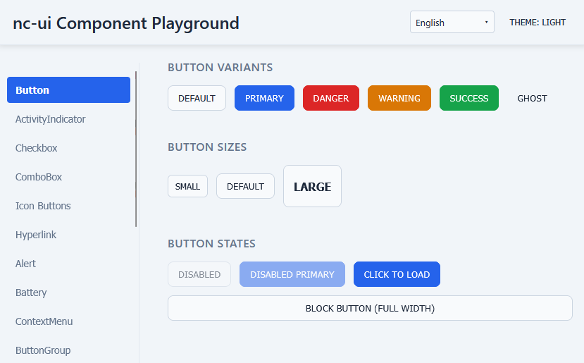
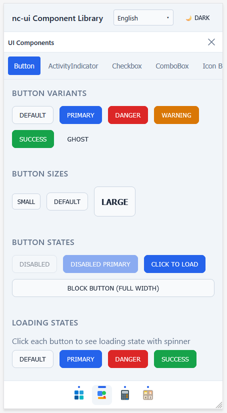

# nc-ui

A high-performance, lightweight React UI component library and extensible application framework.

- 🚀 **Small Footprint**: Only ~75KB bundle size.
- 🏗️ **Application Framework**: Features a flexible, extensible framework for building windowed apps.
- 📱 **Cross-Platform**: Optimized for both desktop and mobile experiences.

Published on npm as [@kingsimba/nc-ui](https://www.npmjs.com/package/@kingsimba/nc-ui)

**[View Demo](https://kingsimba.github.io/nc-ui/)**

<div style="display: flex; gap: 1rem;">
  
  
</div>

## Installation

```bash
npm install @kingsimba/nc-ui
# or
yarn add @kingsimba/nc-ui
# or
pnpm add @kingsimba/nc-ui
```

## Usage

```tsx
import { Button, ActivityIndicator } from '@kingsimba/nc-ui'
import '@kingsimba/nc-ui/styles.css'

function App() {
  return (
    <div>
      <Button variant="primary">Click me</Button>
      <Button variant="danger" size="small">Delete</Button>
      <Button loading>Saving...</Button>
      <ActivityIndicator size="large" />
    </div>
  )
}
```

### Using Icons

Icons are imported from a separate entry point to keep the main bundle size small:

```tsx
import { CloseIcon, EditIcon, TrashIcon } from '@kingsimba/nc-ui/icons'

function MyComponent() {
  return (
    <div>
      <CloseIcon size={24} />
      <EditIcon size={20} color="#3b82f6" />
      <TrashIcon size={18} />
    </div>
  )
}
```

## Components

### Button

```tsx
<Button
  variant="default" | "primary" | "danger" | "warning" | "success" | "ghost"
  size="default" | "small" | "large"
  block={false}        // Full width
  loading={false}      // Shows spinner, disables interaction
  textSelectable={false}
  disabled={false}
>
  Click me
</Button>
```

### ActivityIndicator

```tsx
<ActivityIndicator
  size="default" | "small" | "large"
  color="#custom-color"  // Optional, defaults to --nc-primary
  overlay={false}        // If true, covers parent (parent needs position: relative)
/>
```

## Theming

The library uses CSS variables with `nc-` prefix. Override them in your app:

```css
:root {
  --nc-primary: #your-brand-color;
  --nc-danger: #your-danger-color;
  /* ... see theme.css for all variables */
}

/* Light theme - add .light class to :root */
:root.light {
  --nc-primary: #your-light-primary;
}
```

## Development

```bash
# Install dependencies
npm install

# Start development server
npm run dev

# Build the library
npm run build

# Run linting
npm run lint
```

## Adding Components

1. Create your component in `src/components/`
2. Add styles to `src/styles/theme.css` with `nc-` prefix
3. Export it from `src/index.ts`

## Project Structure

```
src/
├── components/          # UI components
│   ├── Button.tsx
│   └── ActivityIndicator.tsx
├── styles/
│   └── theme.css        # All component styles with nc- prefix
├── lib/
│   └── utils.ts         # Utility functions (cn helper)
└── index.ts             # Main entry - exports all components
```

## CSS Naming Convention

All CSS classes and variables use `nc-` prefix to avoid conflicts:

- Variables: `--nc-primary`, `--nc-button-bg`, etc.
- Classes: `.nc-button`, `.nc-activity-indicator`, etc.
- Modifiers: `.nc-primary`, `.nc-small`, `.nc-loading`, etc.

